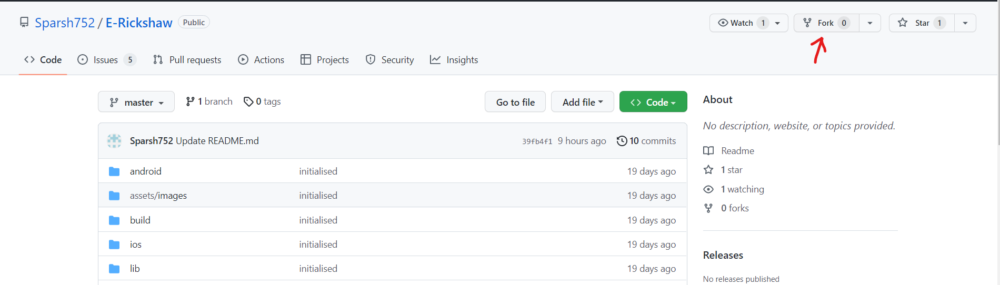
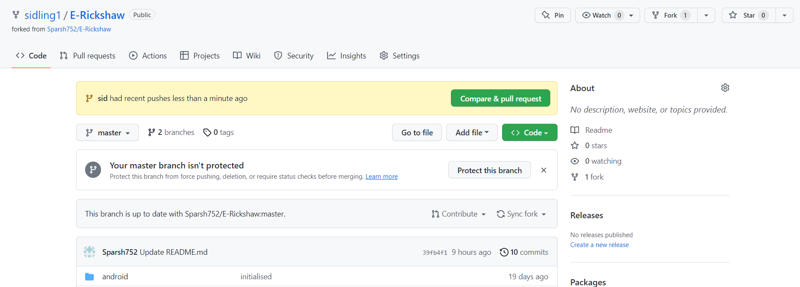
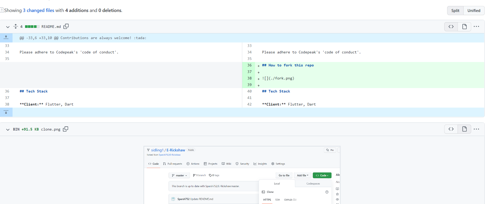
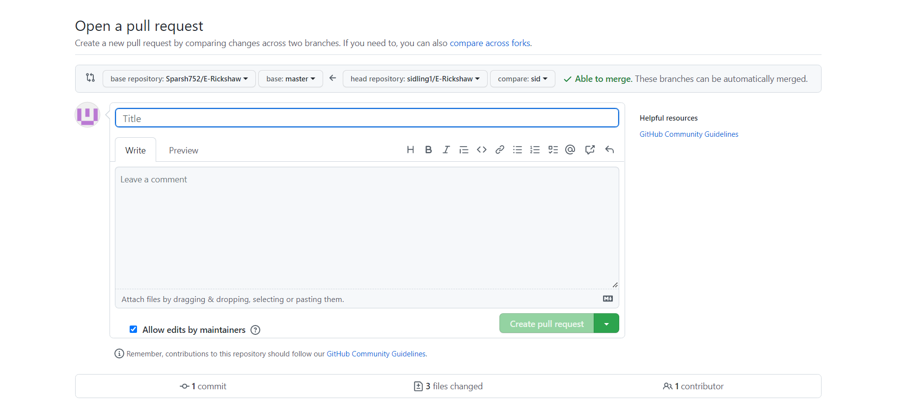

# E-Rickshaw

A useful app for the E-Rickshaw drivers and their customers in IITG Campus. This app displays live requests of the passengers to the E-Rickshaw drivers which they can accept or reject. Once accepted, information like number, name, number-plate etc is exchanged between the driver and the passenger. 

## Acknowledgements

The following people have contributed a lot in this project without whom the project won't be possible:
<ul>
  <li><a href="https://github.com/sarg19">Sarvesh Sarjerao Gholap</a></li>
  <li><a href="https://github.com/Yash-jar">Yash Raj Singh</a></li>
  <li><a href="https://github.com/tanisha-salvi">Tanisha Salvi</a></li>
</ul>

## Installation

Clone this repo to your local storage using

```bash
  git init
  git clone https://github.com/Sparsh752/E-Rickshaw.git
```

Open Android Studio, VS Code or any other editor and run the following command on the terminal.

```bash
  flutter pub get 
  flutter run
```

## Contributing

Contributions are always welcome! :tada:

Please adhere to Codepeak's 'code of conduct'.

## How to fork this repo



2) There will be a prompt to change the name of the repository , fill accordingly.

3) Click on create fork.

## How to create a Pull Request

1) On pushing changes to a forked repository , the repository page on github shows the option to create a Pull request-


2) You can view what changes have been made and If there are any conflicts 



3) Give appropriate title and add a meaningful description then create pull request.

## Tech Stack

**Client:** Flutter, Dart

**Server:** Firebase

## Contact

If any doubt, feel free to contact me on Whatsapp or mail. <br/>
Number: 8770768952 <br/>
Email: sparshmittal2311@gmail.com
